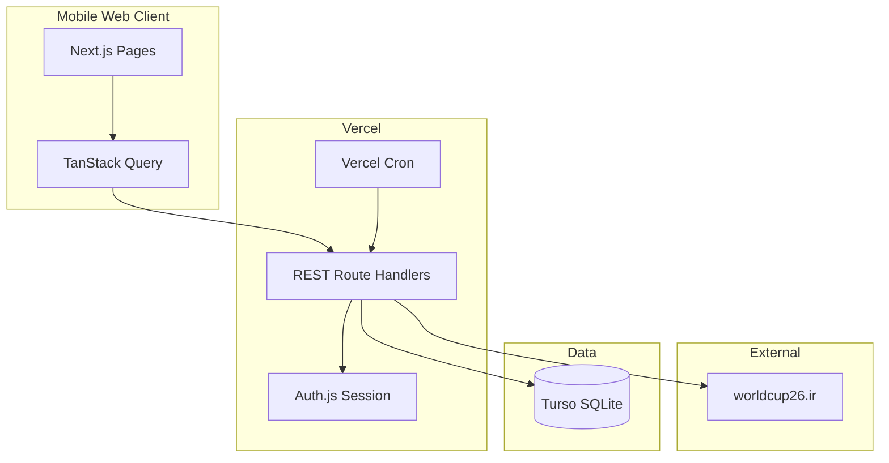
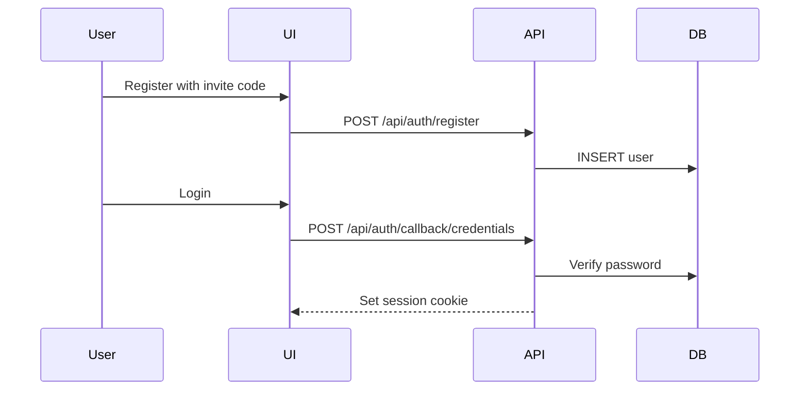
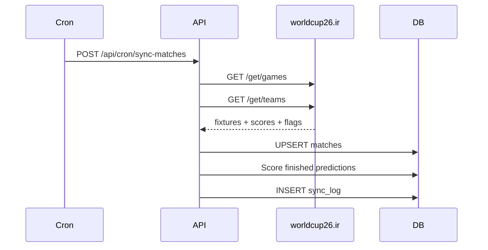

# Architecture

## Overview

Single Next.js application deployed on Vercel. All user-facing pages and REST API routes live in one repo. Match data is synced from [worldcup26.ir](https://worldcup26.ir) into Turso via cron jobs — user requests never hit the external API directly.



## Folder Structure

```
app/
  (auth)/
    login/page.tsx
    register/page.tsx
    layout.tsx
  (app)/
    matches/page.tsx
    leaderboard/page.tsx
    layout.tsx          # bottom nav shell
  api/
    auth/[...nextauth]/route.ts
    auth/register/route.ts
    matches/route.ts
    matches/[id]/route.ts
    predictions/[matchId]/route.ts
    leaderboard/route.ts
    me/route.ts
    cron/sync-matches/route.ts
  layout.tsx            # root layout + providers
  page.tsx              # redirect to /matches

components/
  ui/                   # shadcn components
  app/                  # app-specific components
    bottom-nav.tsx
    match-card.tsx
    providers.tsx

lib/
  db/
    index.ts            # Drizzle client
    schema.ts           # table definitions
  auth/
    config.ts           # Auth.js config
    session.ts          # getServerSession helper
  scoring/
    calculate-points.ts
    config.ts
  api-football/           # worldcup26.ir client (legacy folder name)
    client.ts
    sync.ts
  validations/
    auth.ts
    predictions.ts

docs/                   # this folder
drizzle/                # generated migrations
```

## Auth Flow

1. User registers at `/register` with email, password, name, and invite code.
2. `POST /api/auth/register` validates invite code, hashes password, inserts user.
3. User logs in at `/login` via Auth.js credentials provider.
4. Session stored in HTTP-only cookie; middleware protects `(app)` routes in Phase 4.



## Match Sync Flow

All worldcup26.ir calls happen in the cron sync job, not in user-facing routes.



### Sync Strategy

| Trigger | Requests | Action |
|---|---|---|
| Bootstrap (manual) | 2 | Fetch all 104 WC 2026 fixtures + team flags |
| Daily cron | 2 | Refresh upcoming match metadata |
| Match-day live sync (15 min, Phase 5) | 2 | Update live/finished scores, run scoring — external cron or Vercel Pro |

Fixtures are cached in the `matches` table. The matches API reads from Turso only.

## Mobile-First UI

- Max-width container (`max-w-md`) centered on larger screens
- Bottom tab navigation: Matches | Leaderboard
- Minimum 44px tap targets
- Sheet component for match prediction detail
- Sticky header with app title

## Error Handling

All API routes return JSON:

```json
{ "error": "Human-readable message", "code": "MACHINE_CODE" }
```

Common codes: `UNAUTHORIZED`, `FORBIDDEN`, `NOT_FOUND`, `VALIDATION_ERROR`, `PREDICTION_LOCKED`, `INVITE_INVALID`.
